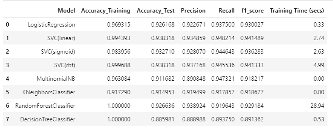
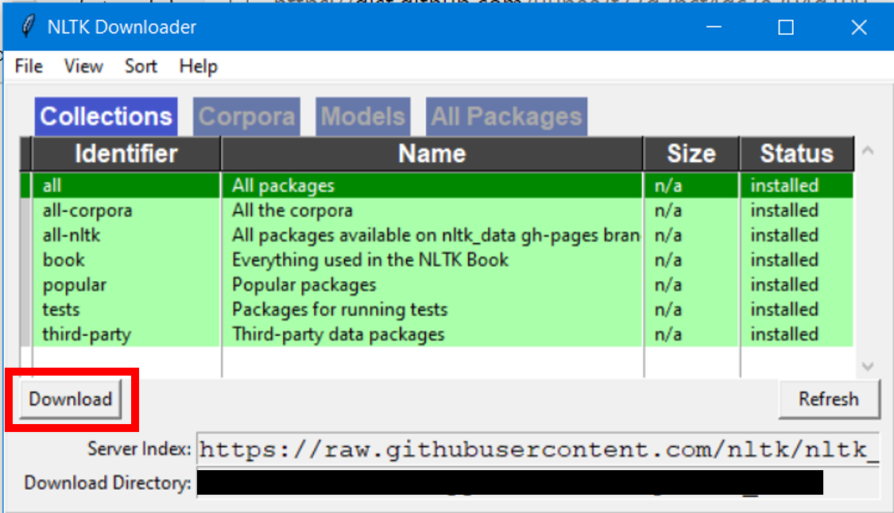

# **Website thử nghiệm phân loại COVID-19 FAKE NEWS**
## **Bộ dữ liệu**
Bộ dữ liệu lấy từ cuộc thi CONSTRAINT-2021 do Codalab tổ chức.


**English Dataset**: https://competitions.codalab.org/competitions/26655 or https://github.com/diptamath/covid_fake_news/tree/main/data

**Link cuộc thi**: https://constraint-shared-task-2021.github.io/

## **Về thiết kế model**

Chúng tôi tiến hành thực nghiệm các mô hình máy học đơn giản sau đây:
- **Decision Tree**
- **KNeighbors Classification**
- **Logistic Classification**
- **NaiveBayes**
- **Random Forest**
- **Support Vector Classification (rbf, sigmoid, linear)**

## **Về dữ liệu đầu vào**
Chúng tôi tiến hành tiến hành xử lý dữ liệu bằng cách chuẩn hóa từ, loại bỏ stopwords và vector hóa các từ bằng thuật toán TF-IDF

## **Kết quả thử nghiệm model**
Dưới đây là hình ảnh chạy thử nghiệm của các model trên



Model SVC(rbf) cho kết quả tốt nhất với Accuracy: 0.9371 và F1-score: 0.9413.
Chúng tôi quyết định chọn model SVC(rbf) và tiếp tục tiến hành tinh chỉnh tham số. 

Kết quả đạt sau khi tinh chỉnh tham số với C=3, max_iter=1000 đã tăng lên  với Accuracy: 0.9411 và F1-score: 0.9442.

## **Xây dựng Website**
Chúng tôi sử dụng Flask một Framework của Python để xây dựng một Website đơn giản với chức năng đưa một mẫu tin tức đầu vào, đầu ra là nhãn (Real hoặc Fake) của mẫu tin tức đó.
Giao diện Website chúng tôi sử dụng Bootstrap 4 và FontAwesome 6 và file style.css tự thiết kế.

## **Hướng dẫn sử dụng**

Tiếp đó cài mở terminal của Python hoặc Anaconda cài đặt các gói Package bằng lệnh dưới đây

```bash
pip install flask pickle nltk
```

Sau khi cài đặt xong tiếp tục trên terminal gõ lệnh:

```bash
cd path\to\run_server\
```

Nếu là lần đầu bạn cài gói Package nltk thì hãy chạy tiếp lệnh dưới đây:

```bash
python nltk_download.py
```

Sẽ có cửa sổ của nltk_download hiện ra và hãy nhấn Download



Sau khi đã thực hiện các bước trên thì bắt đầu chạy Website bằng lệnh:

```bash
python run_server.py
```

**Ngoài ra bạn có thể mở trực tiếp run_server.py bằng Visual Studio Code sau khi đã cài đặt các gói Package trên.**
